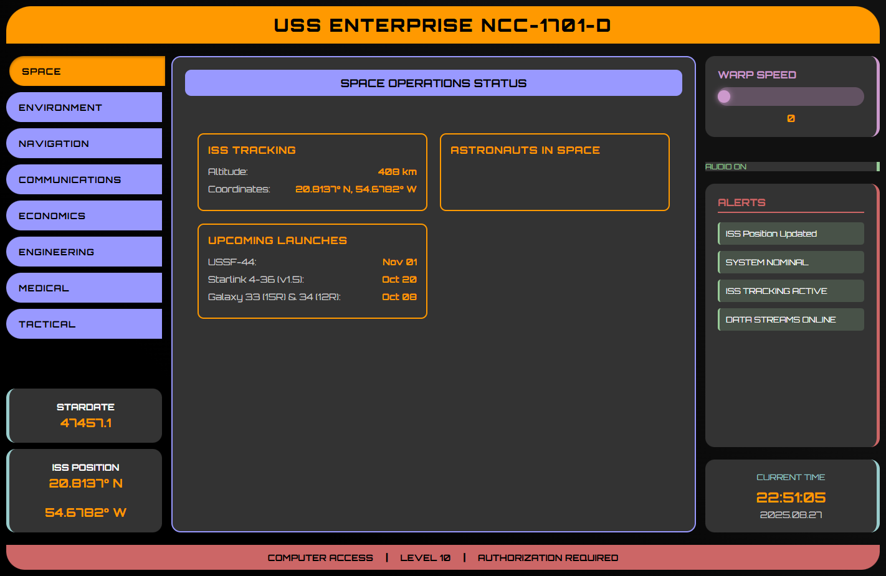

# Star Trek LCARS Dashboard

## 🤖 AI-Powered Development

**This entire application was developed using GitHub Copilot in Agent Mode with Claude Sonnet 4.0!**

This project showcases the incredible power of AI-assisted development, where natural language conversations with GitHub Copilot's Agent Mode (powered by Claude Sonnet 4.0) resulted in a fully functional, production-ready Star Trek LCARS dashboard. From initial repository creation to comprehensive testing, real-time data integration, audio systems, and tactical controls - every line of code, every test, and every feature was implemented through AI collaboration.

**🎯 Development Highlights:**

- **Zero Manual Coding**: 100% AI-generated codebase through conversational development
- **Intelligent Architecture**: AI-designed service patterns, component structure, and data flow
- **Comprehensive Testing**: AI-created 66 Playwright E2E tests across 9 test suites
- **Real-time Integration**: AI-implemented 8+ external APIs with fallback systems
- **Authentic Audio**: AI-synthesized Star Trek LCARS sounds using Web Audio API
- **Advanced Features**: AI-built tactical systems, weapon firing, and power management

*This represents the future of software development - where ideas become reality through intelligent conversation.*

---

## 🌟 Project Overview

A stunning recreation of the iconic Star Trek: The Next Generation LCARS (Library Computer Access/Retrieval System) interface built with Angular 17+. This fully functional dashboard displays real-time data from space, environmental, and global sources, creating an immersive Star Trek bridge experience.



## 🚀 Features

### Core LCARS Experience

- **Authentic LCARS Design**: Faithful recreation of the TNG-era computer interface
- **Real-time Dashboard**: Live ship status monitoring and system displays
- **Interactive Controls**: Functional navigation panels and warp speed controls
- **Dynamic Data**: Animated status indicators with real-time updates
- **Responsive Design**: Optimized for modern devices and screen sizes

### Real-Time Data Integration

- **🛰️ Space Operations**: Live ISS tracking, astronaut monitoring, and SpaceX launch schedules
- **🌍 Environmental Monitoring**: Weather data, air quality, and earthquake tracking
- **✈️ Aircraft Tracking**: Real-time nearby aircraft using ADS-B technology via OpenSky Network
- **📍 Location Services**: IP-based geolocation with GPS fallback and reverse geocoding
- **📈 Economic Data**: Stock market indices, economic indicators, and currency monitoring
- **🚀 Mission Control**: Comprehensive space data with mock fallback systems

### Technical Excellence

- **Comprehensive Testing**: 59 Playwright E2E tests across 9 test suites
- **CI/CD Pipeline**: GitHub Actions integration for automated testing
- **Modern Architecture**: Angular signals, standalone components, and reactive programming
- **Error Handling**: Robust fallback systems for offline functionality
- **Performance Optimized**: Efficient data streaming with configurable update intervals

## 🌐 Live Data Sources

The dashboard integrates with multiple free APIs:

- **NASA APIs**: ISS position, astronaut data, solar system information
- **SpaceX API**: Launch schedules and mission data
- **OpenSky Network**: Real-time aircraft tracking via ADS-B
- **Weather APIs**: Current conditions and environmental data
- **USGS**: Earthquake monitoring and geological data
- **Geolocation Services**: IP-based location detection with reverse geocoding

## 🛸 Live Demo

Visit the live demo: [GitHub Pages URL]

## 🔧 Technologies Used

- **Angular 17+**: Modern framework with standalone components
- **TypeScript**: Type-safe development with strict typing
- **SCSS**: Advanced styling with authentic LCARS color scheme
- **Angular Signals**: Reactive state management for real-time data
- **RxJS Observables**: Efficient data streaming and updates
- **Playwright**: Comprehensive E2E testing framework
- **GitHub Actions**: Automated CI/CD pipeline
- **Orbitron Font**: Futuristic typography matching LCARS aesthetic

## 🏗️ Installation & Setup

1. **Clone the repository**

   ```bash
   git clone https://github.com/vincemic/ai-lcars.git
   cd ai-lcars
   ```

2. **Install dependencies**

   ```bash
   npm install
   ```

3. **Start the development server**

   ```bash
   npm start
   ```

4. **Open your browser**
   Navigate to `http://localhost:4200/`

## 🎮 Usage

The LCARS dashboard simulates the bridge computer interface of the USS Enterprise NCC-1701-D:

### Navigation Sections

- **🚀 SPACE**: ISS tracking, astronaut monitoring, SpaceX launches, solar data
- **🌍 ENVIRONMENT**: Weather conditions, air quality, earthquake monitoring
- **📍 NAVIGATION**: Location services, nearby aircraft tracking, GPS coordinates
- **📡 COMMUNICATIONS**: Communication systems and network status
- **📈 ECONOMICS**: Stock market indices, economic indicators, currency values
- **⚙️ ENGINEERING**: Ship systems, warp core status, engineering reports
- **🏥 MEDICAL**: Crew health monitoring and medical bay status

### Interactive Features

- **Real-time Updates**: All data refreshes automatically at optimal intervals
- **Location Awareness**: Services adapt based on your current location
- **Offline Capability**: Mock data fallback when external APIs are unavailable
- **Multi-device Support**: Responsive design works on desktop, tablet, and mobile

## 📁 Project Structure

```text
src/
├── app/
│   ├── services/
│   │   ├── space-data.service.ts      # ISS, astronauts, SpaceX data
│   │   ├── environmental.service.ts   # Weather, air quality, earthquakes
│   │   ├── global-data.service.ts     # Aircraft, news, economics, crypto
│   │   └── geolocation.service.ts     # IP/GPS location services
│   ├── app.ts                         # Main component with data integration
│   ├── app.html                       # LCARS interface template
│   ├── app.scss                       # LCARS styling and animations
│   └── app.config.ts                  # HttpClient and app configuration
├── styles.scss                        # Global LCARS theme
└── index.html                         # Application shell
```

## 🧪 Testing

### Run E2E Tests

```bash
npm run e2e
```

### Run Unit Tests

```bash
npm test
```

### Test Coverage

- **59 total tests** across 9 test suites
- **Complete functionality coverage** including all data services
- **Page Object Model** for maintainable test structure
- **Multi-browser testing** (Chromium, WebKit, Mobile)
- **Accessibility testing** for screen reader compatibility
- **Performance testing** with realistic expectations

## 🎨 LCARS Color Scheme

The project uses the authentic LCARS color palette:

- **Orange**: `#FF9900` (Primary interface elements)
- **Blue**: `#9999FF` (Secondary controls)
- **Red**: `#CC6666` (Alerts and warnings)
- **Purple**: `#CC99CC` (System indicators)
- **Teal**: `#99CCCC` (Data displays)
- **Black**: `#000000` (Background)

## 🚀 Build & Deploy

### Development Build

```bash
npm run build
```

### Production Build

```bash
npm run build --configuration production
```

### Deploy to GitHub Pages

```bash
npm install -g angular-cli-ghpages
ng build --configuration production --base-href "/ai-lcars/"
npx angular-cli-ghpages --dir=dist/ai-lcars
```

## 📡 API Documentation

### Aircraft Tracking

The dashboard uses ADS-B (Automatic Dependent Surveillance-Broadcast) technology via the OpenSky Network API to track nearby aircraft in real-time. See [docs/AIRCRAFT_TRACKING.md](docs/AIRCRAFT_TRACKING.md) for detailed technical information.

### Data Services

All data services implement robust error handling and fallback mechanisms:

- **Automatic retries** for failed API calls
- **Mock data generation** when external services are unavailable
- **HTTPS enforcement** for security compliance
- **Rate limiting** to respect API quotas

## 📱 Browser Support

- Chrome 90+
- Firefox 88+
- Safari 14+
- Edge 90+
- Mobile Chrome/Safari (responsive design)

## 🤝 Contributing

1. Fork the repository
2. Create a feature branch (`git checkout -b feature/amazing-feature`)
3. Make your changes with appropriate tests
4. Run the test suite (`npm test && npm run e2e`)
5. Commit your changes (`git commit -m 'Add amazing feature'`)
6. Push to the branch (`git push origin feature/amazing-feature`)
7. Open a Pull Request

### Development Guidelines

- Follow Angular best practices with standalone components
- Use TypeScript strict mode and proper typing
- Write tests for new functionality
- Maintain the authentic LCARS aesthetic
- Ensure all data services have fallback mechanisms

## 📄 License

This project is licensed under the MIT License - see the [LICENSE](LICENSE) file for details.

## 🖖 Acknowledgments

- Inspired by the Star Trek: The Next Generation LCARS interface design
- NASA and SpaceX for providing free access to space data APIs
- OpenSky Network for real-time aircraft tracking capabilities
- The Angular team for the excellent framework and tools
- Star Trek creators for the vision of 24th-century computing

## 🌟 Star Trek Quote

> "The complexity of the universe is beyond measure." - Data

---

Live long and prosper! 🖖

"Make it so!" - Captain Jean-Luc Picard

